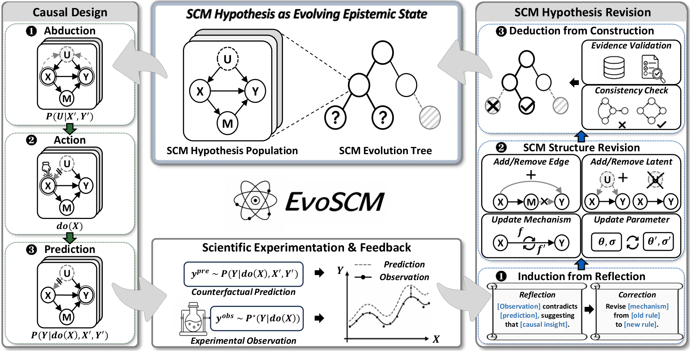
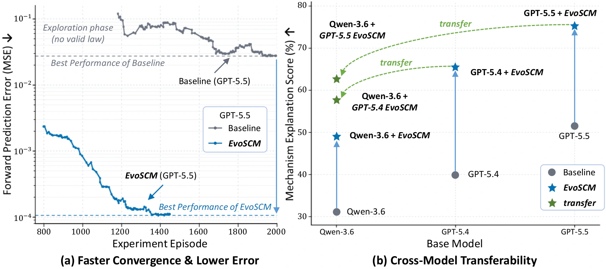
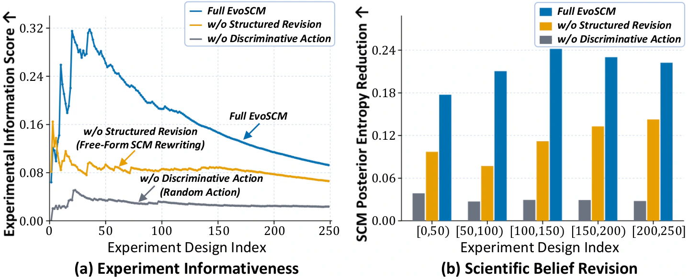
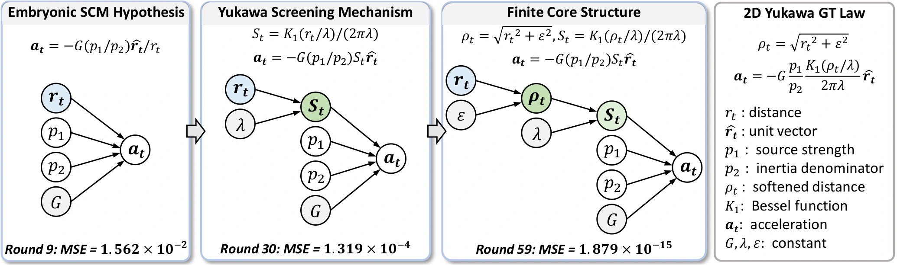

# EvoSCM: Scientific Belief Revision Through Causal Model Evolution and Experimentation

[](https://evoscm.github.io/assets/preprint.pdf)
[](https://arxiv.org/abs/2609.01526)
[](https://evoscm.github.io/)
[](#license-and-citation)

## Abstract

Scientific discovery depends on the ability to form hypotheses, test them through experiments, and revise them when evidence disagrees. Existing LLM agents support this process by improving their reasoning or actions, but their scientific beliefs are often scattered across free-form reasoning and difficult to update coherently. This makes it difficult to identify what failed, what should change, and whether revisions remain consistent with prior evidence. We introduce EvoSCM, which represents scientific beliefs as a population of structural causal model (SCM) hypotheses that can be tested and revised across experiments. EvoSCM formulates scientific discovery as a closed loop in which causal hypotheses guide experimentation and experimental outcomes drive causal model evolution. Competing SCM hypotheses make falsifiable predictions and guide discriminative experiments that separate alternative explanations. When observations contradict these predictions, EvoSCM distills discrepancies into correction rules identifying which aspects of the hypotheses fail to explain the evidence. These rules guide revisions to causal dependencies, latent factors, mechanisms, and parameters. Revised hypotheses are validated against accumulated evidence and carried forward to guide subsequent experiments, allowing scientific beliefs to evolve cumulatively. We evaluate EvoSCM across physics, chemistry and materials, and biology. It consistently outperforms baseline agents and existing evolution methods, yielding more accurate explanations and predictions with more effective use of experimental budgets. The evolved SCMs also transfer across base models, suggesting reusable scientific knowledge beyond any single model's reasoning process.

## Method Overview



**Figure 2: Overview of EvoSCM.** EvoSCM maintains a population of competing SCM hypotheses and evolves it through a closed discovery loop: (1) *Causal Experiment Design:* the agent abductively interprets accumulated evidence, selects discriminative interventions, and commits to falsifiable predictions tested through experimentation; (2) *SCM Hypothesis Revision:* prediction–observation discrepancies are inductively distilled into correction rules that guide targeted revisions to causal structure and mechanisms, while revised hypotheses are deductively validated against accumulated evidence and structural consistency to form the next-round population.

## Installation and API Configuration

Run the following commands from the repository root:

```bash
conda env create -f environment.yml
conda activate evoscm
python -m pip install -e PhysicsSchool -e ScienceAgent
python scripts/smoke_test.py
python -m pytest tests -q
```

The simulator can run on CPU; a local GPU is not required for hosted LLM APIs. The smoke test runs all supported simulators without making model requests.

```bash
export OPENAI_BASE_URL="https://api.openai.com/v1"
export OPENAI_API_KEY="YOUR_API_KEY"
export CLAUDE_BASE_URL="https://api.anthropic.com"
export CLAUDE_API_KEY="YOUR_CLAUDE_API_KEY"
export EVOSCM_MODEL="gpt-5.5"
```

`.env.example` documents the variables; scripts read exported environment variables and do not automatically load `.env`.

Discovery and explanation judging make API requests. Generated scientific Python runs locally during fitting and evaluation; use an isolated environment when running untrusted model outputs.

The default explanation judge is `claude-opus-4-6`, independent of the discovery model, and uses `CLAUDE_BASE_URL` and `CLAUDE_API_KEY`. Numerical MSE evaluation runs locally and does not use the judge model.

## Single Discovery Session

```bash
python scripts/run_discovery.py --world yukawa --method evoscm --model gpt-5.5 --judge-model claude-opus-4-6 --seed 0 --max-rounds 16 --output outputs/evoscm/yukawa_seed0.json
```

For Direct Baseline, use `--method baseline`. The output includes the discovered executable law, explanation, evaluation, per-round record, simulator episode count, and the evolved SCM state when enabled. Output paths must not already exist. Use `--max-episodes` to impose a discovery simulator budget.

## Experiments and Evaluation

```bash
python scripts/run_benchmark.py --config configs/baseline/gpt55.yaml --output-dir outputs/baseline
python scripts/run_benchmark.py --config configs/evoscm/gpt55.yaml --baseline-dir outputs/baseline --output-dir outputs/evoscm
python scripts/evaluate.py --input-dir outputs/baseline --output outputs/baseline_summary.json
python scripts/evaluate.py --input-dir outputs/evoscm --output outputs/evoscm_summary.json
```

The default matrix contains 11 worlds and five seeds. Runs are sequential. When `--baseline-dir` is supplied, each EvoSCM session inherits the corresponding Baseline protocol and receives a discovery episode cap equal to that Baseline session's realized cost. Actual rounds may differ. This is simulator-budget matching, not equal token or dollar expenditure.

## Cross-Model SCM Transfer

Export a source model's learned SCM:

```bash
python scripts/run_transfer.py export --source outputs/evoscm/yukawa_seed0.json --output outputs/transfer/yukawa_seed0_scm.json
```

Switch `OPENAI_BASE_URL` and `OPENAI_API_KEY` to the target model's endpoint, keeping the Claude variables unchanged, then compile and evaluate the transferred knowledge:

```bash
python scripts/run_transfer.py run --scm outputs/transfer/yukawa_seed0_scm.json --model Qwen3.6-35B-A3B --judge-model claude-opus-4-6 --output outputs/transfer/yukawa_seed0.json
```

Use the target model identifier advertised by your endpoint. Compilation uses the target endpoint; explanation judging uses the separate Claude endpoint. The source SCM export retains up to six candidate hypotheses, including the selected hypothesis, but excludes the source executable law, raw experiments, transcripts, evaluation, and reference answers. The target model compiles the frozen SCM without new discovery experiments. Evaluation still runs held-out simulator cases and an explanation judge.

## Worlds, Configuration, and Metrics

Supported worlds:

`gravity`, `yukawa`, `fractional`, `circle`, `three_species`, `dark_matter`, `ether`, `hubble`, `oscillator`, `extra_dimensions`, `coulomb_easy`.

The release uses the N-body backend. World definitions and reference answers belong to the simulator/evaluator; agent prompts receive the public task interface and observations.

| Setting | Default |
|---|---|
| Discovery rounds | 16 maximum |
| Output tokens | 8,192 per model request |
| Seeds | 0–4 |
| Observation noise | 5% of the world signal standard deviation |
| Active SCM capacity | 8 |
| Context character cap | Unset; configurable |

| Metric | Definition |
|---|---|
| Explanation | Mean judge score on the 0–1 scale |
| norm MSE | Evaluator `mean_pos_error` divided by the world reference variance |
| pass@k | World-averaged success estimator using the available independent seed runs |
| simulator episodes | Discovery simulator calls, counting factual and intervention branches separately |

## Analysis

1. EvoSCM achieves efficient scientific discovery and evolves reusable scientific knowledge that transfers across base models.



**Figure 1: Discovery performance and transferability of EvoSCM on DiscoverPhysics.** (a) *Faster Convergence & Lower Error:* EvoSCM achieves lower prediction error while requiring fewer experimental episodes than the baseline agent. (b) *Cross-Model Transferability:* evolved SCMs can be transferred directly across different base models.

2. EvoSCM uses scientific beliefs to guide informative experiments and experimental evidence to revise those beliefs more effectively.



**Figure 3: Experimentation and belief revision analysis on DiscoverPhysics.** (a) *Experiment Informativeness:* EvoSCM designs experiments with higher information scores. The score peaks early when the hypothesis population is most diverse and declines as competing hypotheses converge, leaving less disagreement to exploit. (b) *Scientific Belief Revision:* EvoSCM achieves consistently larger posterior entropy reductions, confirming more effective belief revision.

3. EvoSCM evolves scientific hypotheses through physically meaningful intermediate states, rather than merely refining parameters.



**Figure 4: SCM hypothesis evolution on the Yukawa world in DiscoverPhysics.** EvoSCM progressively recovers the 2D Yukawa ground-truth law through physically meaningful intermediate states, rather than merely fitting parameters along a smooth refinement path. (1) *Round 9:* the agent starts from an embryonic Coulomb-like hypothesis (**a**<sub>t</sub> ∝ 1/r<sub>t</sub>); (2) *Round 30:* a revision introduces a screening factor S<sub>t</sub> = K<sub>1</sub>(r<sub>t</sub>/λ)/(2πλ), coinciding with the Yukawa screening mechanism, resolving intermediate-range overprediction; (3) *Round 59:* a further revision introduces a softened distance ρ<sub>t</sub> = √(r<sub>t</sub><sup>2</sup> + ε<sup>2</sup>), coinciding with the finite core model, resolving residual short-range discrepancies.

## License and Citation

The implementation is distributed under the [MIT License](LICENSE). The simulator and discovery infrastructure build on [DiscoverPhysics](https://github.com/SampsonML/DiscoverPhysics).

```bibtex
@article{zhao2026evoscm,
  title={{EvoSCM}: Scientific Belief Revision Through Causal Model Evolution and Experimentation},
  author={Zhao, Qing and Li, Haowei and Deng, Weijian and Yang, Sibei and Wei, Pengxu and Lin, Liang},
  journal={arXiv preprint arXiv:2609.01526},
  year={2026}
}
```
